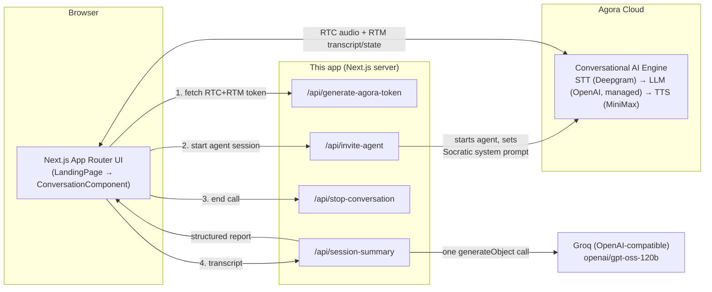

# Misconception Hunter

A voice-native AI tutor that hunts for *misconceptions*, not just wrong answers. Built on the Agora Conversational AI Engine for **Build with Agora Buildathon — Problem Statement 2: AI for Collaborative Education**.

## The Problem

Most AI tutors are answer machines: ask a question, get told if you're right, move on. That teaches students to fish for the correct output, not to fix broken reasoning. A student can get the right answer for the wrong reason and never find out — or get the wrong answer while understanding the concept perfectly, and get "corrected" for a simple slip.

**Misconception Hunter never grades the first answer.** It asks *how* the student got there, keeps asking until it has real evidence, and only names a misconception once a pattern shows up across multiple turns — never from one wrong answer.

## What's Built On Top of the Agora Quickstart

This project starts from Agora's official `agent-quickstart-nextjs` template — the RTC/RTM join flow, the token route's plumbing, the UI kit, and CI scaffolding are the template's. The product work on top of that:

- The Socratic misconception-hunting system prompt, including the five-bucket reasoning taxonomy that decides the agent's next question (`app/api/invite-agent/route.ts`).
- The VAD retune to a 700ms silence tolerance — long enough for a student to think mid-answer without the turn being cut off, tuned specifically for this tutoring use case rather than the template's support-chat default.
- The structured end-of-session report with a strict JSON Schema and a human-escalation flag (`app/api/session-summary/route.ts`, `components/SessionSummaryCard.tsx`).
- The stateless session-ticket security model that scopes token renewal and agent start/stop to the session that created them (`lib/session-ticket.ts`) — the template's version trusted a caller-supplied channel/uid outright.
- The concept-starter question bank, the topic suggester, and the session duration and request-rate limits.

## Target User

A student practicing foundational computer science and AI reasoning out loud (programming fundamentals, algorithms & complexity, data structures, machine learning) — the kind of person who'd otherwise be limited to a textbook or a one-shot answer bot. Secondarily, a teacher who receives the end-of-session report for the small number of sessions the AI flags as needing a human look, instead of having to review every transcript.

## How It Works (Example)

1. Student joins the call. The agent opens with a concrete, loaded question (randomly picked from a bank of classic misconception-bait questions — e.g. *"if a machine learning model gets ninety nine percent accuracy on its training data, does that mean it'll do just as well on new, unseen data?"*), not an open-ended "what do you want to learn."
2. Student answers. The agent does **not** say right/wrong — it asks how they got there.
3. Based on the answer + reasoning, the agent classifies the turn into one of five buckets (correct answer/correct reasoning, correct answer/wrong reasoning, wrong answer/slip, wrong answer/misconception, insufficient evidence) and picks its next question accordingly — harder variant, a trap question that would fool the flawed reasoning, or a light nudge.
4. If the student contradicts something they said earlier, the agent notices and asks which one they trust.
5. If the agent gathers enough evidence of a real misconception (not a single slip), it names the specific flawed rule and says this will be visible to a teacher.
6. On "End Conversation," the client sends the full transcript to a summary endpoint, which produces a structured report: topic, misconception(s) found with confidence and evidence, strengths, recommended next steps, and whether the session should be escalated to a teacher.

## Architecture



- **The live conversation never leaves Agora's managed pipeline.** `app/api/invite-agent/route.ts` configures an `Agent` from the `agora-agents` SDK with Agora-managed STT/LLM/TTS (Deepgram, OpenAI `gpt-4o-mini`, MiniMax) — no custom LLM endpoint sits in front of the voice path. This was a deliberate reliability call for the live demo: an earlier version routed the conversation through a self-hosted custom-LLM proxy so per-turn misconception state could be tracked server-side, but that added a public-tunnel dependency and an extra point of failure with no benefit visible to the student. It was reverted in favor of doing the structured analysis once, after the call, from the transcript the client already has.
- **The structured outcome is a separate, one-shot call**, made directly from the browser to this app's own `/api/session-summary` route (same-origin, no tunnel needed) after the call ends. That route makes a single `generateObject` (Vercel AI SDK) call to Groq's OpenAI-compatible Chat Completions API with a strict JSON Schema, so the report is reliably structured rather than parsed out of prose.
- State during the call lives entirely in the conversation's own message history (Agora's `maxHistory: 30`) plus the system prompt's instructions to reference earlier turns — there's no separate database. This project deliberately avoids introducing a database, RAG, auth, or a dashboard for this prototype stage.

## How Agora Conversational AI Is Used

Agora Conversational AI Engine is the **primary and only** live voice interaction layer (mandatory requirement #1) — not a secondary feature:

- `app/api/invite-agent/route.ts` builds and starts the agent (`agora-agents` SDK: `Agent` + `.withStt()/.withLlm()/.withTts()`), including the full Socratic misconception-hunting system prompt, a randomized concept-starter greeting, and tuned VAD (`silence_duration_ms: 700` — longer than the default so students get room to think mid-answer before the turn is considered over).
- `app/api/generate-agora-token/route.ts` issues combined RTC+RTM tokens (`buildTokenWithRtm`) for the browser.
- `components/ConversationComponent.tsx` joins the RTC channel, publishes the mic, and uses `AgoraVoiceAI` (Agent Client Toolkit) over RTM for live transcript, agent state, and per-stage latency metrics.
- `app/api/stop-conversation/route.ts` stops the agent session.

## Demonstrated Conversational AI Capabilities

(PDF requirement: at least 5 — this project demonstrates 8)

1. **Natural real-time voice interaction** — full ASR → LLM → TTS pipeline via Agora, sub-500ms.
2. **Barge-in / interruption handling** — Agora's VAD-based turn detection (`agent-quickstart`'s standard interruption path); the student can cut the agent off mid-sentence.
3. **Natural turn-taking**, tuned for a tutoring context (700ms silence tolerance instead of the 480ms default, so a thinking pause isn't read as "done talking").
4. **Session-level conversational memory** — the agent references earlier answers and catches contradictions ("earlier you said X, now you're saying Y — which do you trust?").
5. **Dynamic questioning** — the next question is chosen from the student's reasoning bucket (see "How It Works"), never a fixed script.
6. **Recovery from corrections** — explicit prompt rule to surface and probe contradictions rather than silently overwrite earlier context.
7. **Explicit uncertainty handling** — the agent has a named "insufficient evidence" state and is instructed to keep probing rather than force a verdict; the summary schema mirrors this (`overallAssessment: "insufficient_evidence"`).
8. **Code-switching support** — the system prompt allows the agent to respond naturally in whatever language mix the student uses, rather than forcing English-only.

## External Action / Structured Outcome

(PDF requirement #6 — the agent must do more than answer questions)

At the end of every session, `/api/session-summary` produces a structured learning report from the full transcript:

```
{
  topic, overallAssessment,
  misconceptions: [{ description, confidence, evidence[] }],
  strengths[], recommendedNextSteps[],
  escalation: { recommended, reason }
}
```

This is rendered as a Session Summary card (`components/SessionSummaryCard.tsx`) the student sees immediately after the call — a real structured artifact, not just a transcript dump. It also implements the **human escalation path** (PDF requirement #8): sessions with a confirmed misconception or a student who explicitly asked for help are flagged `escalation.recommended: true` with a reason, both spoken during the call ("this will be flagged for your teacher") and shown on the summary card.

## AI Limitations & Safety Considerations

- The agent explicitly never claims to be a substitute for a teacher — see the "Human Escalation" section of its system prompt (`app/api/invite-agent/route.ts`).
- It is instructed to never declare a misconception from a single wrong answer — only after a pattern across multiple turns, with confidence and evidence attached.
- It is scoped to a small, curated set of foundational concepts (programming fundamentals, algorithms & complexity, data structures, machine learning reasoning, AI systems reasoning); it's instructed to redirect if the student asks about something outside that scope, rather than improvising outside its intended domain.
- The end-of-session report is generated by an LLM (Groq `openai/gpt-oss-120b`) reading the transcript — it is a best-effort structured summary, not a verified pedagogical assessment, and is explicitly framed to the student/teacher as such rather than an authoritative grade.
- If the summary call fails (model/network error), the UI shows a clear error state rather than a fabricated or silently-empty report — the failure is never hidden from the user.

## Known Technical Limitations

- The summary/escalation step depends on a second, self-hosted LLM call (Groq) separate from Agora's managed conversational LLM — if that call fails, the conversation itself is unaffected, but no summary is produced for that session.
- Persistence (`lib/db.ts`, Supabase) is optional and best-effort: it only activates when `SUPABASE_URL`/`SUPABASE_SERVICE_ROLE_KEY` are set, and even then only backs the single `/s/[id]` permalink lookup — there's no "my sessions" history, auth, or cross-session view yet.
- Escalation is a visible flag on the summary card and permalink page, not a wired notification/ticketing integration to an actual teacher inbox.
- Single-user sessions only — no classroom-level aggregation or multi-student view.
- Misconception detection is fundamentally LLM judgment, not a verified content-specific pedagogical model; false positives/negatives are possible, which is why the system is intentionally conservative about declaring a misconception.
- Rate limiting (`lib/rate-limit.ts`) is optional infrastructure: it only activates when `UPSTASH_REDIS_REST_URL`/`UPSTASH_REDIS_REST_TOKEN` are set, so a deployment without them relies on the session-ticket model and the duration cap alone.

## Future Evolution

- Wire the escalation flag to a real notification (email/Slack) instead of just the summary card.
- Expand the curated concept set, or let it be configured per classroom/teacher.
- Add auth and a "my sessions" view so a student's persisted sessions are tied to them, not just individually shareable by link, and recurring misconceptions can be tracked across sessions.
- Revisit per-turn structured state tracking (an earlier iteration of this project prototyped exactly that, routing the live conversation through a custom LLM endpoint) if a more production-ready deployment removes the public-tunnel constraint that made it unsuitable for a live demo.

## Run It

```bash
pnpm install
pnpm dev
```

### Environment variables

| Variable                     | Required | Notes                                                                 |
| ----------------------------- | :------: | ---------------------------------------------------------------------|
| `NEXT_PUBLIC_AGORA_APP_ID`   |    ✅    | Agora Console → Project → App ID.                                    |
| `NEXT_AGORA_APP_CERTIFICATE` |    ✅    | Agora Console → Project → App Certificate. Server-side only.         |
| `NEXT_LLM_URL`               |    ✅    | OpenAI-compatible Chat Completions URL used by `/api/session-summary` (e.g. Groq: `https://api.groq.com/openai/v1/chat/completions`). |
| `NEXT_LLM_API_KEY`           |    ✅    | API key for the above.                                               |
| `SESSION_TICKET_SECRET`      |    ➖    | Signs the session tickets described below. Falls back to `NEXT_AGORA_APP_CERTIFICATE` if unset — fine for local dev, set a dedicated value in any deployed environment. |
| `NEXT_PUBLIC_MAX_SESSION_SECONDS` |  ➖  | Hard cap, in seconds, on a single agent session (server `expiresIn` + client auto-end countdown). Defaults to `600` (10 min). Keep this low on a public deployment — it's the main lever on Agora spend per visitor. |
| `UPSTASH_REDIS_REST_URL` / `UPSTASH_REDIS_REST_TOKEN` | ➖ | [Upstash Redis](https://upstash.com) (free tier) REST credentials backing rate limiting (`lib/rate-limit.ts`). Without both set, rate limiting is a no-op. |
| `DAILY_AGENT_SESSION_BUDGET` |    ➖    | Global daily cap on agent sessions started across all callers. Defaults to `20`. Only enforced when Upstash is configured. |
| `SUPABASE_URL` / `SUPABASE_SERVICE_ROLE_KEY` | ➖ | [Supabase](https://supabase.com) (free tier) credentials backing session persistence for the `/s/[id]` shareable report permalink (`lib/db.ts`, `supabase/schema.sql`). Without both set, sessions aren't persisted — the summary still shows normally, there's just no share link. Use the `service_role` key, not `anon`. |

The live conversation itself needs only the two Agora credentials — `NEXT_LLM_URL`/`NEXT_LLM_API_KEY` are only used by the post-call summary endpoint.

### Session tickets (why `/api/generate-agora-token` returns a `ticket`)

`/api/generate-agora-token` no longer trusts a caller-supplied `channel`/`uid` to mint a token — early on, any caller could pass an arbitrary existing channel and get a valid token to join (and publish audio into) someone else's live session. It now returns a signed, stateless **session ticket** (`lib/session-ticket.ts`) alongside the token: an HMAC-signed `{channel, uid, exp}` the client carries forward. Token renewal, `/api/invite-agent`, and `/api/stop-conversation` (via a similarly-signed `control_ticket`) all derive their channel/uid/agent identity from a verified ticket rather than from loose request parameters. This is not user authentication — it doesn't identify *who* the caller is — only proof that they're the same party the server handed this specific session to. See the comment at the top of `lib/session-ticket.ts` for the full reasoning.

### Rate limiting

`/api/invite-agent` (3 starts / 10 min per IP, plus a shared `DAILY_AGENT_SESSION_BUDGET`), `/api/session-summary`, and `/api/suggest-topic` (30 requests / hour per IP each) are all rate-limited via Upstash Redis (`lib/rate-limit.ts`) once `UPSTASH_REDIS_REST_URL`/`UPSTASH_REDIS_REST_TOKEN` are set. The daily budget is checked immediately before the agent actually starts (not earlier), so it's only consumed by real session attempts, not by requests that fail ticket validation.

### Session persistence and the `/s/[id]` permalink

At the end of a session, once the summary is generated and already shown to the student, the client makes a best-effort call to `/api/sessions` to persist the transcript and report to Supabase (`lib/db.ts`). If that succeeds, the summary card shows a "Copy shareable link" control pointing at `/s/<id>` — a server-rendered page (`app/s/[id]/page.tsx`) that re-renders the same report plus the full transcript, with Open Graph tags for a clean link preview. The `<id>` is a random 12-character string (`lib/db.ts`'s `generateSessionId`), not sequential, so permalinks can't be enumerated. Persistence failing (or not being configured) never blocks or invalidates the summary itself — it just means no share link for that session. See `supabase/schema.sql` for the table this expects.

### Commands

```bash
pnpm dev                # start the Next.js dev server
pnpm run lint            # eslint
pnpm run typecheck       # tsc --noEmit
pnpm run verify:api      # API contract checks
pnpm run build           # production build
pnpm run verify          # doctor + lint + typecheck + verify:api + build
```

## Repo Map

- `app/api/generate-agora-token/route.ts` — issues RTC + RTM tokens
- `app/api/invite-agent/route.ts` — starts the agent, Socratic system prompt, VAD tuning, randomized greeting
- `app/api/stop-conversation/route.ts` — stops the agent session
- `app/api/session-summary/route.ts` — the external action: structured post-call report + escalation flag
- `app/api/sessions/route.ts` — best-effort persistence of a finished session for the `/s/[id]` permalink
- `app/s/[id]/page.tsx` — server-rendered shareable report permalink, with Open Graph tags
- `app/api/chat/completions/route.ts` — an OpenAI-compatible SSE proxy scaffold, currently unused by the live path (kept as an extension point; see "Future Evolution")
- `components/LandingPage.tsx` — pre-call / in-call / summary view state, session lifecycle
- `components/ConversationComponent.tsx` — RTC client, transcript state, `AGENT_METRICS`
- `components/SessionSummaryCard.tsx` — post-call summary card (loading/error/share state) around `ReportBody`
- `components/ReportBody.tsx` — pure report rendering, shared between the post-call card and the permalink page
- `lib/conversation.ts` — transcript normalization, visualizer state mapping, transcript→summary-request mapping
- `lib/session-ticket.ts` — signed session tickets scoping token renewal and agent start/stop
- `lib/rate-limit.ts` — per-IP and daily-budget request limiting (Upstash Redis, optional)
- `lib/db.ts` — session persistence backing the `/s/[id]` permalink (Supabase, optional)
- `types/conversation.ts` — shared request/response contracts

## Troubleshooting

- **Agent does not join or transcripts are missing:** run `agora project doctor --deep`.
- **Summary card shows an error:** check `NEXT_LLM_URL`/`NEXT_LLM_API_KEY` are set and the Groq model in `app/api/session-summary/route.ts` hasn't been deprecated (check [Groq's model deprecation page](https://console.groq.com/docs/deprecations)).
- **Transcript speakers inverted:** check the `uid === "0"` remap in `components/ConversationComponent.tsx`.

## License

Released under the [MIT License](./LICENSE).
